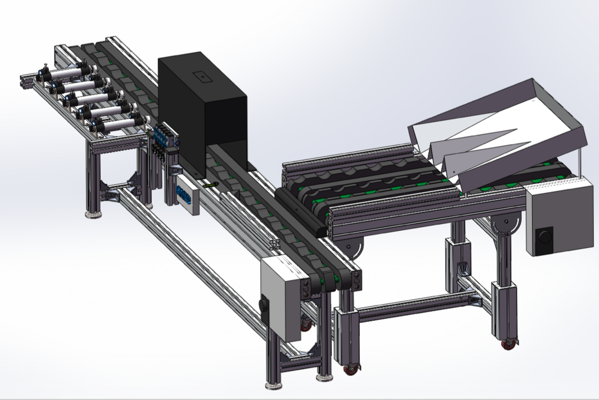

# sorting4peach
## 整体线路连接示意图

## 分桃装置全景图



##安装PaddlePaddle
```
pip install paddlepaddle
```
## 模型训练脚本
```
python/train.py
```
## 模型预测脚本
```
python/infer.py
```
## 数据集
------- 
* http://pan.baidu.com/s/1i4FLMip (1.2G)

# 待补充
- 各个功能模块说明
- 使用说明
